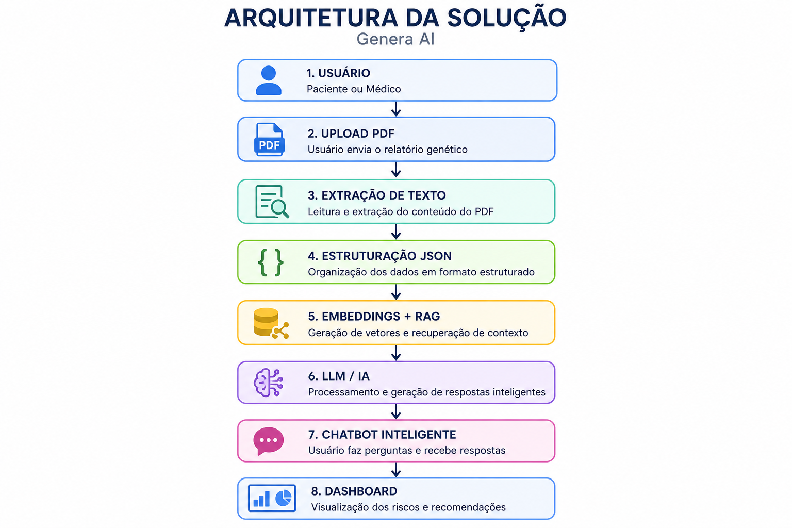
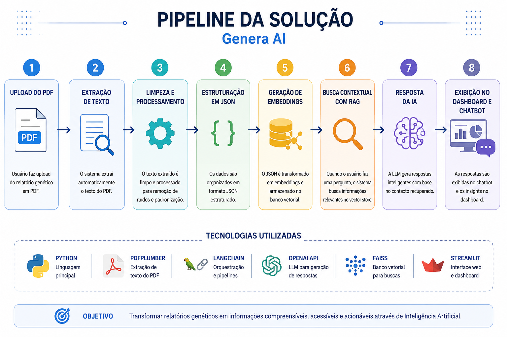

# Challenge Dasa - Genera AI

## Integrante

Ana Carolina Belchior Cavallini

---

## Sobre o Projeto

O projeto Genera AI tem como objetivo transformar relatórios genéticos em PDF em informações organizadas, acessíveis e interativas utilizando Inteligência Artificial.

A solução busca facilitar a interpretação de exames genéticos do Genera, permitindo que pacientes compreendam seus resultados em linguagem simples e possam interagir com os dados através de um assistente inteligente.

---
## Protótipo Inicial

O projeto possui uma estrutura inicial em Python utilizando Streamlit para exibição dos dados genéticos estruturados em JSON.

O protótipo simula:

- leitura dos dados do relatório;
- visualização das predisposições genéticas;
- organização estruturada das informações;
- base para integração futura com IA e chatbot.

---

## Problema

Os relatórios genéticos disponibilizados pelo Genera possuem informações extremamente importantes para prevenção e saúde personalizada, porém são apresentados em PDFs técnicos, extensos e difíceis de interpretar.

Os usuários frequentemente possuem dificuldade para:

- Entender termos médicos e genéticos;
- Identificar riscos relevantes;
- Interpretar predisposições genéticas;
- Relacionar resultados com hábitos e prevenção;
- Navegar entre grandes volumes de informação.

Além disso, o modelo atual não oferece interação inteligente ou personalização da experiência.

---

## Solução Proposta

A solução proposta utiliza Inteligência Artificial, NLP e RAG para transformar os relatórios genéticos em uma experiência interativa e compreensível.

O sistema permitirá:

- Upload de relatórios em PDF;
- Extração automática das informações;
- Organização dos dados em JSON;
- Interpretação em linguagem simples;
- Chatbot inteligente para perguntas;
- Recomendações preventivas;
- Dashboard visual dos riscos genéticos.

---

## Usuários

| Usuário | Necessidade |
|---|---|
| Paciente | Entender os resultados do exame |
| Médico | Consultar predisposições rapidamente |
| Laboratório | Melhorar experiência do cliente |

---
## Arquitetura da Solução

---

## Pipeline da Solução

1. Upload do PDF;
2. Extração do texto;
3. Limpeza e processamento dos dados;
4. Estruturação em JSON;
5. Geração de embeddings;
6. Busca contextual com RAG;
7. Resposta da IA;
8. Exibição no dashboard e chatbot.

---

## Tecnologias Propostas

| Área | Tecnologia |
|---|---|
| Front-end | Streamlit |
| Back-end | Python |
| NLP | LangChain |
| IA | OpenAI API |
| Extração PDF | pdfplumber |
| Banco Vetorial | FAISS |

---

## User Stories

### US01
Como paciente, quero entender meu relatório em linguagem simples.

### US02
Como paciente, quero fazer perguntas sobre meu exame.

### US03
Como médico, quero visualizar riscos genéticos rapidamente.

---

## Governança e Segurança

A solução seguirá princípios da LGPD, garantindo proteção de dados sensíveis, controle de acesso e uso responsável da Inteligência Artificial.

---

## Próximas Sprints

### Sprint 2
Protótipo funcional.

### Sprint 3
Chatbot inteligente.

### Sprint 4
Dashboard interativo.

### Sprint 5
Testes e refinamento.
